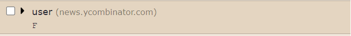

# Phase III Recap

This document is meant to be used as a recap of the current architecture and logic as it is at the beginning of Phase III.

## Entry Point

`src/popup.js` is the main entry point for the popup (note that the app has both a popup and an options page, but most everything is in the popup for now.) Here is where the entire UI is built imperatively.

`popup.js` bootstraps the application with everything it needs, creating the `CookiesTabbedView`, the main UI component of the popup.

## Building the UI

The UI is built imperatively. For example,

```js
const myContainer = document.getElementById("my-id");
const myHeading = document.createElement("h1");
myHeading.innerText = "My heading";
myContainer.appendChild(myHeading);
```

This would result in

```html
<div id="my-id">
    <h1>My heading>
</div>
```

### Why build imperatively

> But why would you do it that way?! It's so ugly!

I know. We do it that way because most of the popup needs to be built using resusable components. For example, each cookie row element needs to be recreated many times, with complex logic and state:



This is an extremely common problem that has been addressed about 100000 times in the JS world---first with jQuery, templating languages like handlebars, then finally with libraries like React, Vue, Angular, and Svelte.

For accessibility for developers (ironically), we opted to use vanilla JS for now.

### How we build imperatively

Each component is represented as a JS class in the `src/ui` directory. All components inherit from `UiElement`, which is quite simple:

```js
class UiElement {
    /**
     *
     * @returns Promise<HtmlElement>
     */
    async getHtmlElement() {
        const placeholder = document.createElement("div");
        placeholder.innerHTML = "[UI ELEMENT MISSING IMPLEMENTATION]";
        return placeholder;
    }
}
```

That method should be overriden by all deriving classes, returning the HTML element for that component.

For example, following the example from before

```js
class MyHeading extends UiElement {
    constructor(text) {
        this.text = text;
    }

    async getHtmlElement() {
        const myHeading = document.createElement("h1");
        myHeading.innerText = this.text;
        return Promise.resolve(myHeading);
    }
}
```

To use a custom component, we just get the html element and append it to the DOM:

```js
const myContainer = document.getElementById("my-id");

const myHeading = new MyHeading("test 123");
const myHeadingElem = await myHeading.getHtmlElement();

myContainer.appendChild(myHeadingElem);
```

## CookieManager: The main logic

Nearly all business logic right now is contained in `src/js/cookie-manager.js`. That is not to say it is a god class, it still delegates out functionality to two primary classes:

1. `src/js/chrome-cookie-store.js` - all interaction with the `chrome.cookie` API is contained here. If we ever want to target other browsers, we could mostly just create a new class like `firefox-cookie-store.js` and inject that into the cookie manger
2. `src/js/cookie-jar-store.js` - all interaction with the local browser storage that relates to storing/retrieving "jarred" cookies is done here

Sometimes, a single use-case will required interaction between both stores. For example, `CookieManager.storeCookie` lookes like this:

```js
async storeCookie(cookie) {
        if (cookie.isStored) return;
        cookie.isStored = true;

        await this.cookieJarStore.addCookie(cookie);
        await this.chromeCookieStore.removeCookie(cookie.details);
    }
```

### Jar Cookie Example Stack

From top to bottom, here might be the call stack required for a user to jar a cookie:

1. <user clicks "jar" button on `CookieRow` component>

That is handled by this event listener:

```js
jarIconContainer.addEventListener("click", () => {
    this.cookiesManager.storeCookie(this.cookie);
    this.deleteCookieRow();
});
```

2. `CookieManager.storeCookie(cookie)` is invoked

    3. `CookieJarStore.addCookie(cookie)` is invoked

        4. Adds the cookie to `chrome.storage.local`

    4. `ChromeCookieStore.removeCookie(cookie.details)` is invoked

        6. Removes the cookie from `chrome.cookies`

Finally, `CookieRow.deleteCookieRow` is invoked to remove the HTML element from the DOM:

```js
deleteCookieRow() {
    this.cookieRowElement.remove();
}
```

## Other Logic

Logic related to remembering which cookies are selected for bulk actions are in `src/js/cookies/bulk-cookie-selector.js`. It is a glorified dictionary of cookies.

The applications representation of a cookie in a jar is the `JarCookie` class found at `src/js/cookies/jar-cookie.js`. It is almost a copy of the cookie spec from chrome, with the addition of a few things like the `isStored` property.

`src/js/helpers/` is a grab bag of different utility functions. For example, `encryption.js` is used to encrypt/decrypt text (used for importing/exporting encrypted cookies), and `file-reader-util.js` helps with reading the contents of files.
